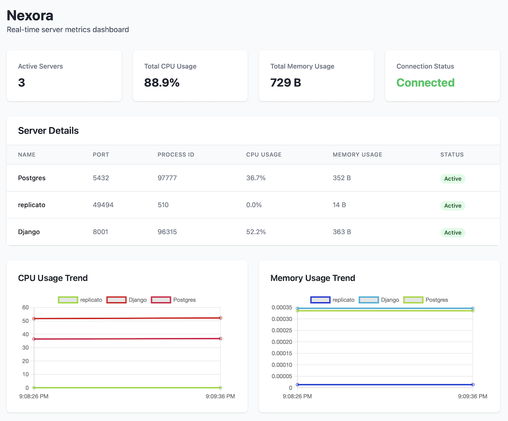

# Nexora: Lightweight Server Monitoring & Resource Tracker


## Overview

**Nexora SM** is a lightweight server monitoring tool designed to dynamically detect and track running services on your system. It provides real-time updates on resource usage (CPU and memory) via a web-based dashboard powered by WebSocket connections. Additionally, Nexora supports seamless merging of detected services with predefined nodes specified in a configuration file (config.yaml), offering flexibility and ease of monitoring.

## Screenshot



## Key Features

* **Real-Time Service Monitoring:** Track your running services and see live CPU, memory, and port usage.

* **Configuration-Aware Detection:** Automatically merge detected services with pre-configured nodes from config.yaml.

* **WebSocket-Driven Dashboard:** Receive live updates directly on your browser through WebSocket connections.

* **Lightweight and Simple:** No complex setup—just a straightforward tool to monitor your services efficiently.

## Prerequisites

Ensure lsof command is available on your system (used for detecting running services).

## How to install and use

```bash
# Download the appropriate release based on your operating system and architecture
wget https://github.com/rdmnl/nexora/releases/download/v0.1.0/nexora-<os>-<arch>-v0.1.0.tar.gz

# Extract the downloaded tarball
tar -xzvf nexora-<os>-<arch>-v0.1.0.tar.gz

# Change into the extracted directory
cd nexora-<os>-<arch>

# Add the current directory to your PATH to run nexora from anywhere
export PATH=$PATH:$(pwd)

# Run nexora with the desired configuration
nexora --config-path=config.yaml --port=<available-port>
```

### Configuration

Customize the config.yaml to define static nodes (services) you want to monitor. Each node should specify the service name and port. Example:

```bash
nodes:
  - name: "MyApp"
    port: 8080
  - name: "Redis"
    port: 6379
```

## Access the Dashboard:
Open your web browser and visit:

```bash
http://localhost:12321
```

## License

This project is licensed under the MIT License. See the [LICENSE](license) file for details.

## Contributing

Feel free to submit issues or pull requests to improve the tool!
